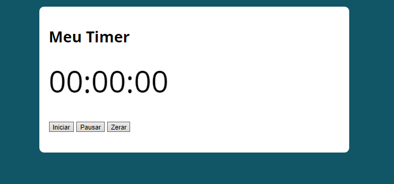
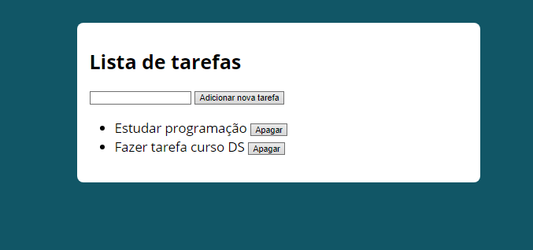
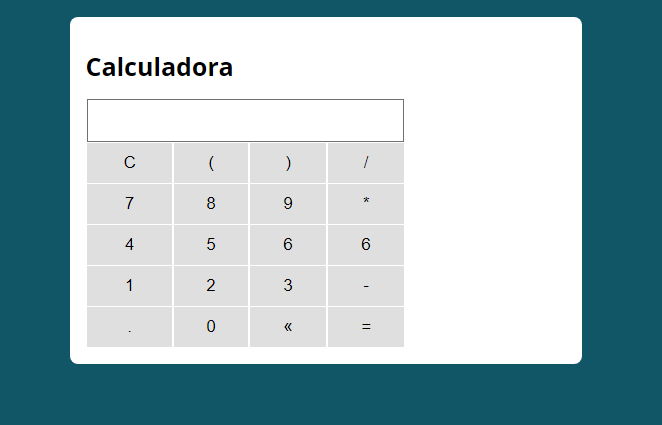

<<<<<<< HEAD
# Sessão de JavaScript do Curso JavaScript e TypeScript do Basico ao Avançado

# Conteudo do sessão
* Estrutura de dados em JavaScript
* Lógia de prgramação em JavaScript
* Funções
* Objetos 
* Programação orientada a objetos
* JavaScript Assincrono
* Webpack
* Babel
* ES6

# Projetos

# Curso

[Curso de JavaScript e TypeScript do básico ao avançado 2021](https://www.udemy.com/course/curso-de-javascript-moderno-do-basico-ao-avancado/)
